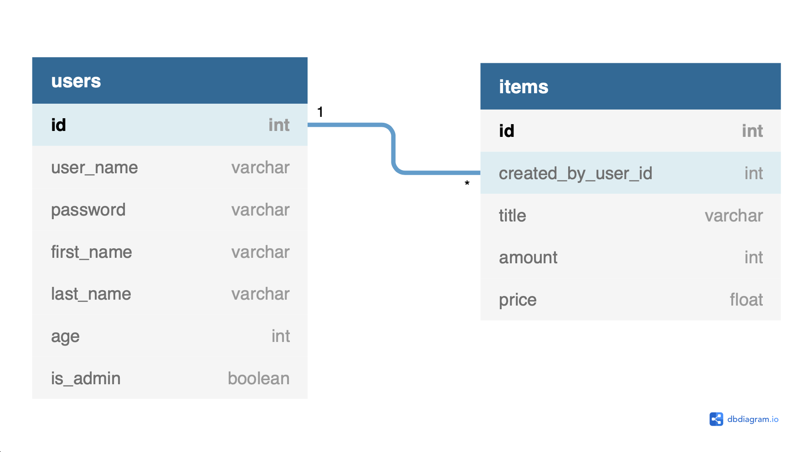

# Pet Shop

---

## Website to ability to manage the products

---
I used Flask for completing this task. This website allows to add, edit and delete products. There is a feature that allows to buy products and the total cost calculation option.

___

---
To install requirements run:

`pip install -r requirements.txt`

---

To run:

`FLASK_APP=app`

---
